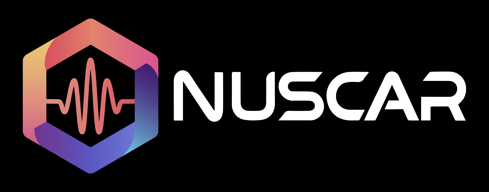

# 🚀 NUSCAR: High-Performance Side-Channel Analysis Toolbox


**A modern side-channel analysis toolbox** — an efficient arsenal designed for side-channel researchers and security engineers

> **Copyright Notice**
> This project is intended for learning and research use only. If you need to use this project's code in a commercial product, please contact us (sales@osr-tech.com) to obtain a commercial license.
> If the **NUSCAR** platform helps your research and experiments, we would greatly appreciate it if you cite this project in your work and recommend it to others!

<p align="center">

</p>

## 🌟 Key Highlights

- **⚡  Extreme performance**: core algorithms accelerated with Rust + PyO3, with improved parallel-computing efficiency
- **📊 Full-stack toolchain**: an end-to-end solution from trace acquisition to side-channel analysis
- **📚 Efficient development**: Python API, making it easy to extend with new analysis algorithms
- **🧠 Integrated analysis methods**: CPA/DPA/LRA/TTest/ML/Template
- **📈 Interactive visualization**: an intelligent plotting engine built on Plotly
- **🗃️ Trace file handling**: efficient management of massive trace files in the Zarr format
- **🔄 Format interoperability**: supports conversion between Zarr/ETS/Trs and other formats
- **⏬ Rich datasets**: provides multiple open-source side-channel [dataset downloads](#-open-source-side-channel-datasets-download-) for convenient testing and validation

## 📦 Quick Install
Download the `whl` package matching your `python` version and install it with `pip`.
```bash
pip install nuscar-1.0.0-cp312-cp312-win_amd64.whl
```
## 🚴 Quick Start
``` python
import nuscar
import numpy as np

# Load trace data
reader = nuscar.ReaderZARR("../datasets/aes_stm32.zarr")
ctn = nuscar.ContainerZARR(reader)

# Run a CPA attack on the AES algorithm
sf = nuscar.ciphers.aes.attack_first_sbox_hw()
dist = nuscar.distinguisher.CPADistinguisher()
task = nuscar.task.DistinguisherTask(ctn, sf, distinguisher=dist, steps=10)
task.run()

# Show the results
key = np.frombuffer(bytes([0x5e, 0x75, 0xe3, 0x26, 0x56, 0xba, 0x6b, 0x8c, 0x6e, 0x26, 0xd2, 0x54, 0xf2, 0xfc, 0x1b, 0x44]), dtype='uint8')  # for verification only
task.show_candidate(correct_key=key)
```
We recommend using the [JupyterLab](https://jupyter.org/) environment to run NUSCAR for side-channel analysis. In the `tutorials` directory, we provide more example Jupyter Notebooks.

## 🔨 Development Environment Setup

Below are the instructions for setting up the development environment. Please follow these steps:
1. Install the Rust build environment
  - Install the Rust toolchain https://www.rust-lang.org/tools/install
  - Download and install MSVC https://learn.microsoft.com/en-us/windows/dev-environment/rust/setup
2. Clone the NUSCAR project code:
  ```bash
    git clone https://github.com/OSR-Lab/nuscar.git
  ```
3. Install the PyO3 build environment:
  ```bash
    pip install maturin
  ```
4. Build nuscar:
  ```bash
  maturin build --release  # generates the whl file in the target/wheels folder
  ```
## 🎥 Video Tutorials

[NUSCAR Quick Start Part 1: Environment Setup](https://www.bilibili.com/video/BV1hzKVzREq9/?share_source=copy_web&vd_source=f288f8b94276ccdd2d6b1ca1b5f64701)
[NUSCAR Quick Start Part 2: Power Analysis Example](https://www.bilibili.com/video/BV18zKVzREXD/?share_source=copy_web&vd_source=f288f8b94276ccdd2d6b1ca1b5f64701)

## 📈 Open-Source Side-Channel Datasets Download ⏬

**Research on side-channel attacks and defenses depends heavily on real data. Open-source datasets provide academia and industry with a ready-to-use experimental foundation, avoiding the expensive or complex process of collecting hardware data. Researchers can use standardized datasets to develop, validate, and compare new attack algorithms (such as deep-learning models) or defense schemes (such as masking and noise injection). Students can use open-source datasets to intuitively understand the principles of side-channel attacks (such as extracting keys from power traces) and hands-on implement attack or defense experiments, filling the gaps left by theoretical teaching.**

**The NUSCAR project has collected the currently mainstream open-source side-channel datasets. To make them convenient to use in NUSCAR, the datasets have been uniformly converted to the efficient ZARR format. They can be obtained via this [cloud drive share link](https://pan.baidu.com/s/1PzqRtmQEMjnFR_O2qF1AOg?pwd=4j8p).**


| No. | Name                                                                                              | Description                                                                                                                                      | Traces                                                                                                     | Sample points                              |
|----|---------------------------------------------------------------------------------------------------|--------------------------------------------------------------------------------------------------------------------------------------------------|------------------------------------------------------------------------------------------------------------|--------------------------------------------|
| 1  | [DPA-V2](https://dpacontest.telecom-paris.fr/v2/index.php)                                        | AES-128 hardware implementation (SASEBO GII board), power acquisition, 32 fixed keys (20,000 traces each).                                        | 640,000  <br/> 20,000                                                                                      | 3,253  <br/> 3,253                         |
| 2  | [DPA-V4](https://dpacontest.telecom-paris.fr/v4/rsm_traces.php)                                   | AES-256 RSM software implementation (ATMega-163), electromagnetic acquisition, 1 fixed key.                                                       | 20,000                                                                                                     | 435,002                                    |
| 3  | [DPA-V4.2](https://dpacontest.telecom-paris.fr/v4/42_traces.php)                                  | AES-128 RSM software implementation (ATMega-163), electromagnetic acquisition, 1 fixed key.                                                       | 5,000                                                                                                      | 1,704,402                                  |
| 4  | [ASCAD V1](https://github.com/ANSSI-FR/ASCAD)                                                     | boolean masked AES software implementation (ATMega8515 board), electromagnetic acquisition, 1 fixed key. ascadv1 is the extracted points-of-interest data; ascadv1_raw is the raw data. | 60,000 <br/> 60,000                                                                                        | 700 <br/>100,000                           |
| 5  | [ASCAD V2](https://github.com/ANSSI-FR/ASCAD)                                                     | affine masked AES software implementation (STM32 board), power acquisition, random keys.                                                         | 510,000                                                                                                    | 15,000                                     |
| 6  | [Aisylab AES_HD](http://aisylabdatasets.ewi.tudelft.nl/)                                          | AES-128 hardware implementation (SASEBO GII board), power acquisition, 1 fixed key. Includes a base dataset and an extended dataset; the first 45,000/450,000 traces are the training set and the last 5,000/50,000 are the attack set. | 50,000  <br/> 500,000                                                                                      | 1,250   <br/> 1,250                        |
| 7  | [CHES CTF 2018](http://aisylabdatasets.ewi.tudelft.nl/)                                           | masked AES-128 software implementation, power acquisition, 1 fixed key. The first 4500 traces are the training set and the last 500 are the attack set. | 5,000                                                                                                      | 2,200                                      |
| 8  | [CHES CTF 2020](https://ctf.spook.dev/)                                                           | Clyde-128 software implementations (sw3, sw4) and hardware implementations (hw2, hw3), 220,000 traces in total, including fixed keys (fkey) and random keys (rkey), power acquisition. | 100,000 <br/> 100,000 <br/>  10,000 <br/> 10,000                                                           | 7,000 <br/> 7,000 <br/> 62,500	<br/>83,333 |
| 9  | [Ed25519 (WolfSSL)](https://github.com/leoweissbart/MachineLearningBasedSideChannelAttackonEdDSA) | unprotected EdDSA (Curve25519) software implementation, STM32 board, random keys, power acquisition.                                              | 6,400                                                                                                      | 1,000                                      |
| 10 | [ECC EdDSA](https://github.com/AISyLab/IterativeDLFramework)                                      | protected EdDSA (Curve25519) software implementation, including datasets for two protection mechanisms, random keys, power acquisition. The first 63,750 traces are the training set and the last 12,750 are the attack set. | 76,500 <br/> 76,500                                                                                        | 8000 <br/>1000                             |
| 11 | [REASSURE ECC](https://zenodo.org/records/3609789)                                                | protected ECDH (Curve25519, CSPOINTER) software implementation, STM32 board, 5997 ECDH operations, random keys, electromagnetic acquisition. Each trace corresponds to one iteration of the Montgomery-ladder scalar multiplication, and 255 traces correspond to one ECDH (5997*255=1529235). | 1529235                                                                                                    | 5500                                       |
| 12 | [Jlsca traces](https://github.com/Keysight/Jlsca)                                                 | SHA1, DES, 3DES, AES-128, AES-192, AES-256 software implementations.                                                                              |                                                                                                            |                                            |
| 13 | PANDA 2018 Challenge                                                                              | Includes three challenge sets: (1) a standard AES-128 software implementation, capturing the power-leakage waveform of the first round of the encryption operation; (2) an AES-128 software implementation with a non-standard S-box, capturing the power-leakage waveform of the first round of the encryption operation; (3) an AES-128 software implementation with a non-standard S-box, where the value of the first key byte (k0) is known to be in the range 0x50~0x80. | 1,200  <br/> 9,995 <br/> 997  <br/> 5120                                                                   | 61,049 <br/>67,970 <br/>67,970 <br/>50,000 |
| 14 | [9th (2024) National College Cryptographic Mathematics Challenge, Problem 3](http://www.cmsecc.com/xiazai/) | AES-128 software implementation, power acquisition, including low-, medium-, and high-noise samples. You must write power-analysis attack code based on the given leakage samples and corresponding plaintext information to recover the value of the first byte of the key used by the AES crypto chip (see the documentation inside the archive for details). |                                                                                                            |                                            |
| 15 | [Financial Cryptography Cup, Problem 3](https://fincryptography.cn/)                              | post-quantum signature algorithm Dilithium software implementation (STM32 board), power acquisition. The captured traces mainly cover the process of Dilithium generating the polynomial vector y; the parameters are chosen for NIST Security Level 2 (see the PDF documentation for details). | 40,000 <br/> 40,000 <br/> 30,000 <br/> 20,000 <br/> 10,000 <br/> 8,000 <br/> 5000;3500;2500;1500;700 <br/> | 46,000                                     |

**Download file checksums (SHA256):**
- aes_hd_ext.zarr: c64d632a961605f31c70291b538aed9a16cd491877de6c6e2244807415494258  
- aes_hd.zarr: 33abc31709f5b51f8e2ff765c21b203971796d894ca896b319d349f24065f1d2  
- ascadv1_raw.zarr: f08fff0950914c5e47af632155d663b4c2fb0401655bd9cc1f2980b81d49971a  
- ascadv1.zarr: dde347b4a7b1c8ad0b71c150c1056c1a6847d48aaa3ea7528145acc5c4523a8a 
- ascadv2-extracted.zarr: e657b6a71103678cecef283c9d2f8afff1c6b704d2f67ffbe09a2ef44d3ea758
- ches_ctf.zarr: 66755e37a653984e177bc8053db26d2059a64727936e0c0f92e24d8828df6e49
- cswap_arith.zarr: a4cdd0457e5c1551e5bfcc34a2045e5229da3d963427e99d7d8a7a42b5e0f976  
- cswap_pointer.zarr: 8136ea936fa8f9684f9cb041290e528f426f03588dbcabe44ca378a9c3b43ea1
- cmsecc2024-chal3.zip: 639401d98dbe483016f5f942b5fc4afc173b05feee5d18e8dd6408c0a4116ef9
- databaseEdDSA.zarr: 36ed7c8b8ebb634ccc1c97bfc0720593a72f57ae7488cd47dc112a655013f8ed
- dpav2_k32.zarr: 849c215ac62f7421e8340f55ff211f57111e0a0452a154fa4ec1991d2b814715
- dpav2.zarr: 3c946e10a4d3b8039cc832d2d0a6947c6e74dd6a94c7b332f59d87529ec65e89
- dpav4_2_rsm_k00.zarr: 0574d4730635af10d873268ac94e10adf5391c03493aa8226ca9e0a8766292a7
- dpav4_rsm.zarr: d51fa3125a7da3dd26152f4b5fe37371eeed73909a268eededebd600a267ee37
- fc_dilithium_training.zarr: cc635c20cf81bcede7da5019194045b0ca6ae08b486020f2c765f21bd0f0c5d6
- fc-dilithium_attack0.zarr: 66182df95ad2628fb845a9392b89fe50dcc4b8a1e7367f2139d305e9ae1b537a
- fc-dilithium_attack1.zarr: 89022ce0c95fd11b84cae4542a29d2f767881251aae3cf3bfde4dfd462f5c799
- fc-dilithium_attack2.zarr: 83db548c44250dab3ed556603a6977d08c95b0e46e28ee1f1d37dbd9b452491d
- fc-dilithium_attack3.zarr: 2869349a481efcbd48a1a59052651cbc8e5c3479f02689214ce817b80afcb699
- fc-dilithium_attack4.zarr: 22d81e22b72135e70ead4c50c9f24f75ea3e773fb83a57e2bbf0e6464191f3f7
- fc-dilithium_attack5-9.zarr.tar: 034c80285bbd78be6fbe9c2ba02b7aa6339c839f92b7084050058c4908fa47c0
- fkey_hw2_K1_100000_0.zarr: 3d644d696eecba59e14198e7f69855bf7f94e79d47c8c3512cfe0d6fe4374529
- fkey_sw3_K0_10000_0.zarr: 6bf5846e7f48169925833bf076b3aee300cd6a63d0839c3c7820a532e786e2c6
- fkey_sw4_K0_10000_0.zarr: 6937ac706c37fb4fe38351da62e0d64cf31f4d5b073a28b0bacb273fd5ab420f
- Panda2018_Challenge1.zarr: 018e0090a187f3ec83255fbf1ba952ed5edb8c7b02fb3881d16e50ed73b312ec 
- Panda2018_Challenge2-1.zarr: 879f763bc5ee165444a862e791e7f67742d5c131c4fc0d1c63ec7a7515c953e5
- Panda2018_Challenge2-2.zarr: fa057e7ebc7ee9b0a49d5ded996303559254238f9d0656f7bd389c9fdd7f3f82
- Panda2018_Challenge3.zarr: 806214ecc5e2cca05da869ae4f19cbdd03a385923b59d074ab629f310aa52187
- REASSURE_c25519.zarr: 78b75464f609a6ecbfb7483fe5f514162df1c207565574918343e0629c027b1a
- rk_hw3_100000_0.zarr: f24c486421fa0e32fb68724b6b208af1614a9f82528cc9d3a142d5d1a4e66eb0
- Jlsca-traces.zip: a7f842523b39113935897d90674b9fbe5df58cf34b48aa3459e35b88cc6ae060
